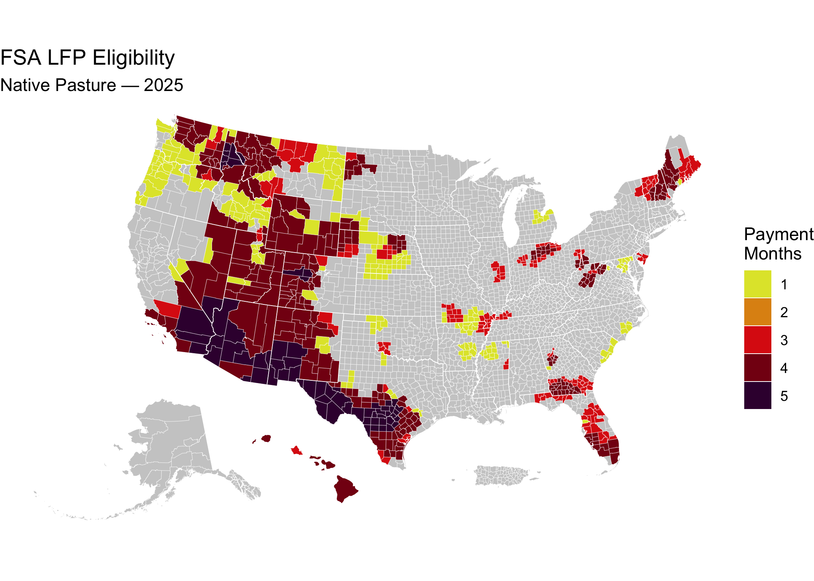

[](https://github.com/sustainable-fsa/fsa-lfp-eligibility)
[](https://zenodo.org/badge/latestdoi/587852382)

# FSA Annual County Eligibility Data from the Livestock Forage Disaster Program, 2008–2025

This repository is an archive of the annual county-level eligibility
data for the [Livestock Forage Disaster Program
(LFP)](https://www.fsa.usda.gov/resources/programs/livestock-forage-disaster-program-lfp).

The data in this repository were acquired via FOIA requests
**2025-FSA-04690-F**, **2025-FSA-08422-F**, and **2026-FSA-02433-F** by
R. Kyle Bocinsky (Montana Climate Office). This replaces previously
filed and fulfilled FOIA response covering 2012–2022
(**2023-FSA-00937-F**). All FOIA responses, including the original Excel
workbooks, are archived in the [`foia`](./foia) directory.

## 🗂️ Contents

- [`foia/2026-FSA-02433-F Bocinsky.zip`](./foia/2026-FSA-02433-F%20Bocinsky.zip)
  — 2025 eligibility data
- [`foia/2025-FSA-08422-F Bocinsky.zip`](./foia/2025-FSA-08422-F%20Bocinsky.zip)
  — 2012 through July 2025 eligibility data
- [`foia/2025-FSA-04690-F Bocinsky.zip`](./foia/2025-FSA-04690-F%20Bocinsky.zip)
  — 2008 through 2024 eligibility data (incomplete)
- [`foia/2023-FSA-00937-F Bocinsky.zip`](./foia/2023-FSA-00937-F%20Bocinsky.zip)
  — previous FOIA data and correspondence (archived)
- [`fsa-lfp-eligibility.csv`](https://data.sustainable-fsa.com/fsa-lfp-eligibility/fsa-lfp-eligibility.csv)
  — cleaned and consolidated data, one record per FSA county, program
  year, pasture type, and disaster type
- [`qa-report.txt`](https://data.sustainable-fsa.com/fsa-lfp-eligibility/qa-report.txt)
  — QA summary and flagged records for the published data
- [`fsa-lfp-eligibility.R`](./fsa-lfp-eligibility.R) — processing script
- [`fsa-lfp-eligibility.qmd`](./fsa-lfp-eligibility.qmd) — Quarto
  dashboard source
- [`fsa-lfp-eligibility.html`](https://data.sustainable-fsa.com/fsa-lfp-eligibility/fsa-lfp-eligibility.html)
  — interactive summary dashboard
- [`_manifest.txt`](https://data.sustainable-fsa.com/fsa-lfp-eligibility/_manifest.txt)
  — flat index of every file in the S3-hosted mirror

## ☁️ Archive Hosting & Automated Publishing

The consolidated data (`fsa-lfp-eligibility.csv`), the QA report
(`qa-report.txt`), the `assets/` directory the dashboard reads from, and
the `foia/` correspondence are all mirrored to S3, served via CloudFront
at <https://data.sustainable-fsa.com/fsa-lfp-eligibility/> (browse the
[archive listing](https://data.sustainable-fsa.com/fsa-lfp-eligibility/)
or
[`_manifest.txt`](https://data.sustainable-fsa.com/fsa-lfp-eligibility/_manifest.txt)
for a flat index). The interactive dashboard itself is served
separately, via GitHub Pages at
<https://sustainable-fsa.com/fsa-lfp-eligibility/>.

Publishing is handled by
[`fsa-lfp-eligibility.R`](fsa-lfp-eligibility.R) via the shared
[`R/s3-archive.R`](R/s3-archive.R) helpers, and runs automatically in
GitHub Actions
([`.github/workflows/fsa-lfp-eligibility.yaml`](.github/workflows/fsa-lfp-eligibility.yaml))
whenever the script, dashboard, or workflow changes, or on manual
dispatch. The workflow authenticates to AWS via GitHub OIDC (no
long-lived credentials stored in the repo), re-renders the README and
dashboard, and commits them back to git only if the rendered output
changed.

------------------------------------------------------------------------

## 📥 Input Data: FOIA Excel Workbooks

The FOIA response contains LFP eligibility data from **2012 through
2025** for each pasture type, county, and program year. FOIA
**2025-FSA-04690-F Bocinsky** includes eligibility determinations from
2008 through 2024, but not many of the other variables requested. Each
program year was delivered in individual Microsoft Excel files.

Column names and data can vary subtly by year. The processing workflow
in [`fsa-lfp-eligibility.R`](./fsa-lfp-eligibility.R) harmonizes the
files from , and appends the 2008 through 2011 data from the earlier
FOIA.

------------------------------------------------------------------------

## 📤 Output Data: Cleaned CSV

The file
[`fsa-lfp-eligibility.csv`](https://data.sustainable-fsa.com/fsa-lfp-eligibility/fsa-lfp-eligibility.csv)
is a tidy dataset for analysis and visualization.

Each record is one eligibility determination, uniquely identified by
`FSA State Code`, `FSA County Code`, `Program Year`, `Pasture Type`, and
`Disaster Type`.

**The key is the FSA county, not the Census county.** FSA administers
seven Census counties as two or three separate offices and determines
eligibility for each independently, so those counties carry several
records per program year and pasture type — Pottawattamie IA, Nye NV,
St. Louis MN, Polk MN, Otter Tail MN, Aroostook ME, and Oglala Lakota
SD. The determinations genuinely differ: for the keys where both halves
of a split county report, Pottawattamie disagrees on `Payment Factor`
and Polk and St. Louis on the qualifying drought date. Anything
aggregating by FIPS county must decide how to combine them rather than
assuming one row per county.

### Variables in Output

| Variable Name | Description |
|----|----|
| `FIPS State Code` | A two-digit FIPS state code |
| `FIPS County Code` | A three-digit FIPS county code |
| `FIPS State Name` | U.S. state |
| `FIPS County Name` | County or county-equivalent name |
| `FSA State Code` | A two-digit FSA state code (not always FIPS) |
| `FSA County Code` | A three-digit FSA county code (not always FIPS) |
| `FSA County Name` | FSA county (service area) name, as reported by FSA |
| `Program Year` | Year the data applies to |
| `Pasture Type` | Pasture classification (e.g., Native, Improved) |
| `Disaster Type` | Type of disaster (e.g., Drought, Fire) |
| `D2 START DATE`:`D4B END` | Start and end dates for qualifying drought events |
| `Date of Qualifying Drought` | Start date of qualifying disaster |
| `Drought Factor` | Qualifying payments given the drought severity |
| `Grazing Period Start Date` | Start date of grazing period for the pasture type |
| `Grazing Period End Date` | End date of grazing period for the pasture type |
| `Maximum Eligible Payment Months` | Duration of grazing period, in months |
| `Payment Factor` | Number of eligible payments |
| `Note (FOIA 2025-FSA-04690-F Bocinsky)` | for 2008 through 2011, the qualifying drought type |

------------------------------------------------------------------------

## 📊 Demonstration Dashboard

The Quarto dashboard
[`fsa-lfp-eligibility.qmd`](./fsa-lfp-eligibility.qmd) provides:

- An **interactive viewer** to explore LFP Eligibility by county, year,
  disaster, and pasture type
- A **tool for researchers and policymakers** to assess temporal trends

<iframe src="fsa-lfp-eligibility.html" frameborder="0" allowfullscreen style="width:100%;height:40vw;">

</iframe>

Access a full-screen version of the dashboard at:\
<https://data.sustainable-fsa.com/fsa-lfp-eligibility/fsa-lfp-eligibility.html>

------------------------------------------------------------------------

## 📍 Quick Start: Visualize a FSA LFP Eligibility Map in R

This snippet shows how to load the FSA LFP Eligibility file from the
archive and create a simple map using `sf` and `ggplot2`.

``` r
# Load required libraries
library(sf)
library(ggplot2) # For plotting
library(tigris)  # For state boundaries
library(rmapshaper) # For innerlines function

## Get the LFP Eligibility data
eligibility <- 
  readr::read_csv("fsa-lfp-eligibility.csv")

counties <- 
  tigris::counties(cb = TRUE, 
                   resolution = "5m",
                   progress_bar = FALSE) |>
  dplyr::filter(
    !(STATE_NAME %in% c("Guam", 
                        "American Samoa", 
                        "United States Virgin Islands", 
                        "Commonwealth of the Northern Mariana Islands"))
  ) |>
  sf::st_cast("POLYGON", warn = FALSE, do_split = TRUE) |>
  tigris::shift_geometry() |>
  dplyr::group_by(STATEFP, COUNTYFP) |>
  dplyr::summarise(.groups = "drop") |>
  sf::st_cast("MULTIPOLYGON")

## Calculate the 2025 LFP Eligibility for Native Pasture, and
## combine with the county data
eligibility_counties <-
  eligibility |>
  dplyr::filter(`Pasture Type` == "Native Pasture",
                `Program Year` == 2025) |>
  dplyr::transmute(
    id = paste0(`FIPS State Code`, `FIPS County Code`),
    `Payment Factor` = factor(`Payment Factor`,
                            levels = 1:5,
                            ordered = TRUE)
  ) |>
  dplyr::left_join(
    counties |>
      dplyr::transmute(id = paste0(STATEFP, COUNTYFP))
    ) |>
  sf::st_as_sf()

# Plot the map
ggplot(counties) +
  geom_sf(data = sf::st_union(counties),
          fill = "grey80",
          color = NA) +
  geom_sf(data = eligibility_counties,
          aes(fill = `Payment Factor`), 
          color = NA,
          show.legend = TRUE) +
  geom_sf(data = rmapshaper::ms_innerlines(counties),
          fill = NA,
          color = "white",
          linewidth = 0.1) +
  geom_sf(data = counties |>
            dplyr::group_by(STATEFP) |>
            dplyr::summarise() |>
            rmapshaper::ms_innerlines(),
          fill = NA,
          color = "white",
          linewidth = 0.2) +
  # Use the same color scale used by the LFP
  # https://www.fsa.usda.gov/documents/native-pasture-2024-lfp-01-23-25
  scale_fill_manual(
    values = c("1" = "#E0E436", 
               "2" = "#DF9114", 
               "3" = "#DD2313", 
               "4" = "#850014", 
               "5" = "#3B003C"),
    drop = FALSE,
    name = "Payment\nMonths") +
  labs(title = "FSA LFP Eligibility",
       subtitle = "Native Pasture — 2025") +
  theme_void()
```



------------------------------------------------------------------------

## 📝 Citation

If you use this data in published work, please cite:

> USDA Farm Service Agency. *Livestock Forage Disaster Program
> Eligibility, 2008–2025*. Obtained under FOIA requests
> 2025-FSA-04690-F, 2025-FSA-08422-F, and 2026-FSA-02433-F; curated and
> archived by R. Kyle Bocinsky, Montana Climate Office, University of
> Montana. Sustainable FSA project. Accessed YYYY-MM-DD.
> <https://sustainable-fsa.com/fsa-lfp-eligibility/>
>
> DOI: <https://doi.org/10.5281/zenodo.15491626>

Machine-readable metadata are in [`CITATION.cff`](CITATION.cff);
GitHub’s **Cite this repository** button (top right of the repo page)
renders it as APA or BibTeX.

**Acknowledgment**: This work is part of the [*Enhancing Sustainable
Disaster Relief in FSA
Programs*](https://www.ars.usda.gov/research/project/?accnNo=444612)
project, supported by the USDA Office of the Chief Economist, Office of
Energy and Environmental Policy, and the USDA Climate Hubs.

## 📄 License

- **Raw FOIA data** (USDA): Public Domain (17 USC § 105)
- **Processed data & scripts**: © R. Kyle Bocinsky, released under
  [CC0](https://creativecommons.org/publicdomain/zero/1.0/) and [MIT
  License](./LICENSE) as applicable

------------------------------------------------------------------------

## ⚠️ Disclaimer

This dataset is archived for research and educational use only. It may
not reflect current USDA administrative boundaries or official LFP
policy. Always consult your **local FSA office** for the latest program
guidance.

To locate your nearest USDA Farm Service Agency office, use the USDA
Service Center Locator:

🔗 [**USDA Service Center
Locator**](https://offices.sc.egov.usda.gov/locator/app)

------------------------------------------------------------------------

## 👏 Acknowledgment

This project is part of:

**[*Enhancing Sustainable Disaster Relief in FSA
Programs*](https://www.ars.usda.gov/research/project/?accnNo=444612)**\
Supported by USDA OCE/OEEP and USDA Climate Hubs\
Prepared by the [Montana Climate Office](https://climate.umt.edu)

------------------------------------------------------------------------

## ✉️ Contact

Questions? Contact Kyle Bocinsky: <kyle.bocinsky@umontana.edu>
